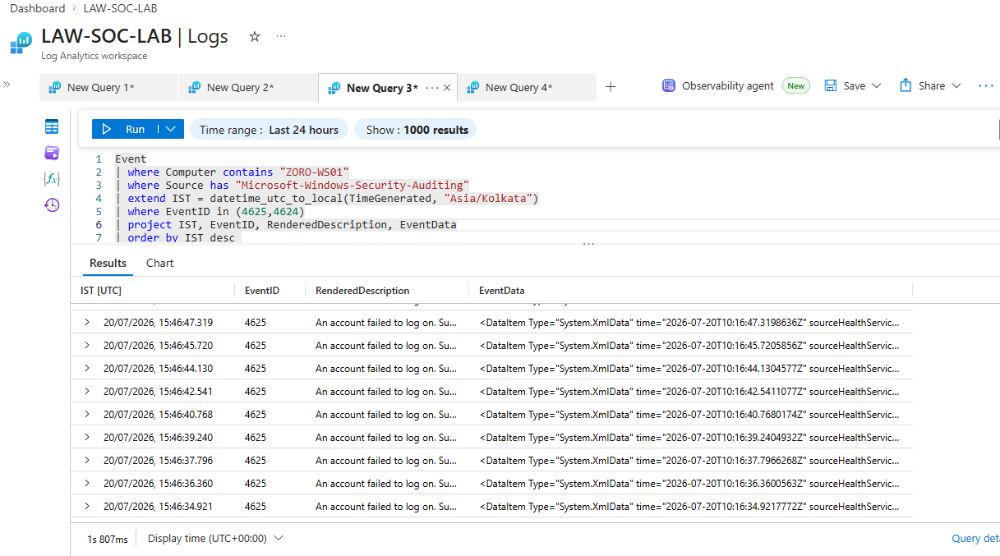
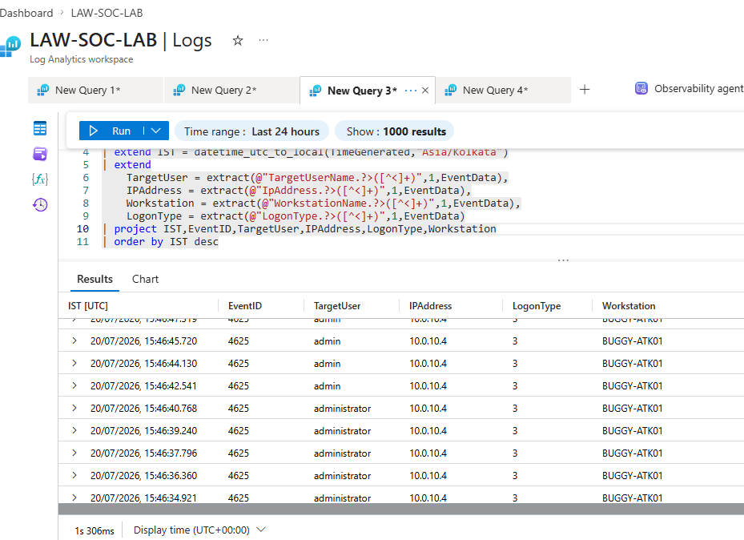
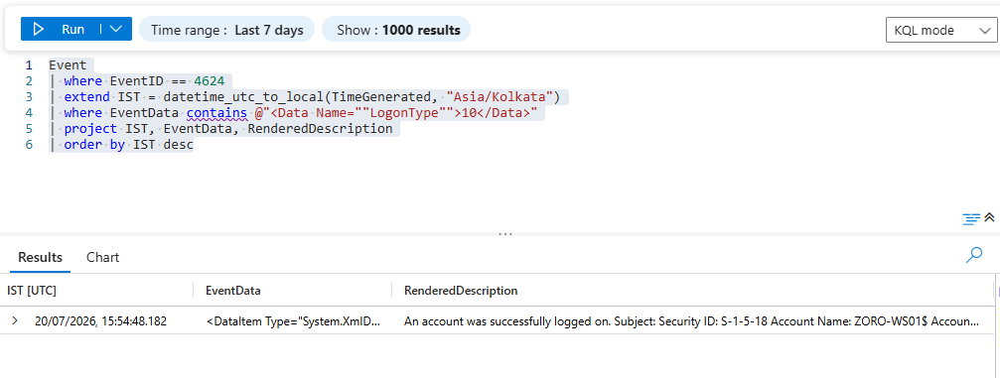
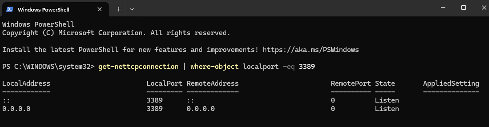
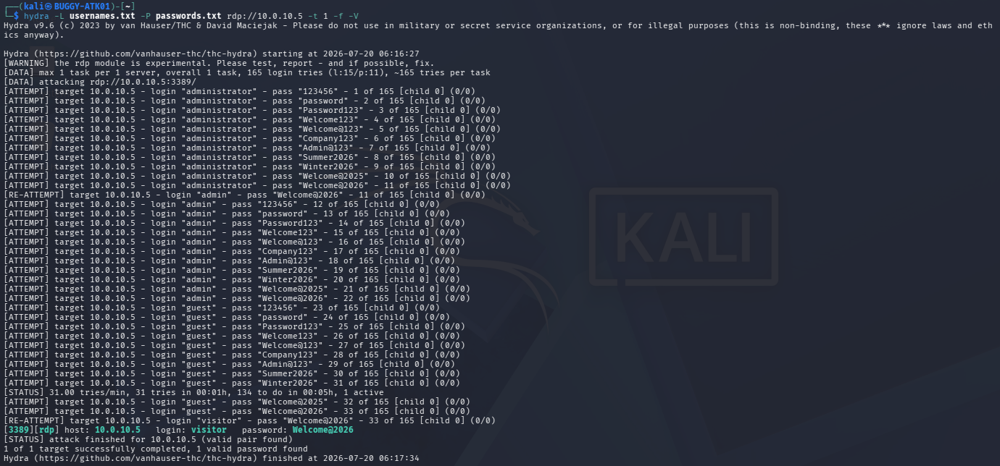
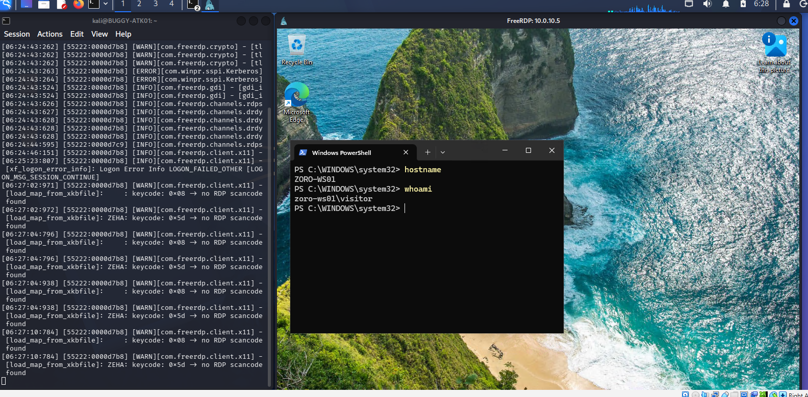
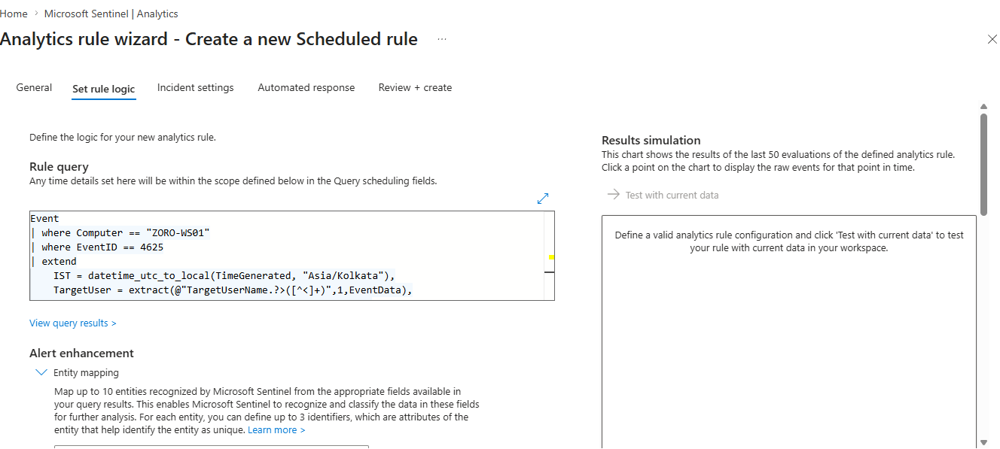
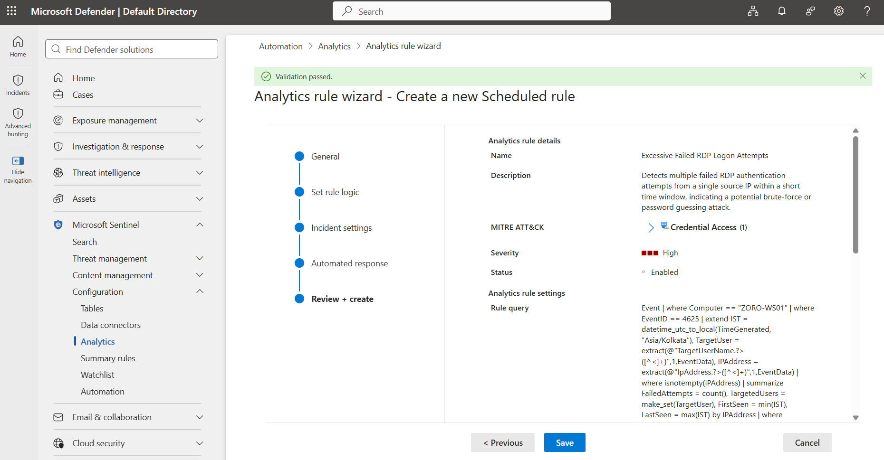

# Investigation 001

# Unauthorized Remote Authentication Attempt Against RDP Service

| Field | Value |
|--------|-------|
| Investigation ID | 001 |
| Phase | Phase 01 – Endpoint Security |
| Category | Unauthorized Remote Access |
| Platform | Microsoft Sentinel |
| MITRE ATT&CK | T1110 - Brute Force |
| Status | ✅ Completed |

---

# Incident Overview

On **20 July 2026**, an employee reported that their workstation unexpectedly logged them out while actively working. According to the employee, another user appeared to be signing into the system without their knowledge.

Since unauthorized remote access could not be ruled out, the incident was escalated to the Security Operations Center (SOC) for investigation.

---

# Objective

Investigate the reported authentication activity, determine whether unauthorized remote access occurred, identify the attack vector, validate the collected evidence, and develop a Microsoft Sentinel detection capable of identifying similar attacks in the future.

---

# Lab Environment

| Component | Details |
|----------|---------|
| Attacker | Kali Linux (BUGGY-ATK01) |
| Victim | Windows 11 (ZORO-WS01) |
| SIEM | Microsoft Sentinel |
| Log Source | Windows Event Logs (Azure Monitor Agent + Data Collection Rule) |

---

# Initial Investigation

The SOC analyst began by reviewing Windows Security authentication events collected from the affected endpoint.

To establish a timeline of authentication activity, the following KQL query was executed.

```kusto
Event
| where Computer contains "ZORO-WS01"
| where Source has "Microsoft-Windows-Security-Auditing"
| extend IST = datetime_utc_to_local(TimeGenerated,"Asia/Kolkata")
| where EventID in (4625,4624)
| project IST, EventID, RenderedDescription, EventData
| order by IST desc
```

The query identified multiple **Event ID 4625** records followed by a successful **Event ID 4624**.

This confirmed that repeated failed authentication attempts occurred before a successful authentication event was eventually recorded.

> **Figure 1 - Authentication Timeline**
>


---

# Evidence Correlation

After identifying repeated authentication failures, the SOC analyst extracted additional information from the Windows Security events to better understand the attack pattern.

The following KQL query was used to extract the targeted username, source IP address, workstation name, and logon type from the collected authentication events.

```kusto
Event
| where Computer contains "ZORO-WS01"
| where Source has "Microsoft-Windows-Security-Auditing"
| extend IST = datetime_utc_to_local(TimeGenerated,"Asia/Kolkata")
| extend
    TargetUser = extract(@"TargetUserName.*?>([^<]+)",1,EventData),
    IPAddress = extract(@"IpAddress.*?>([^<]+)",1,EventData),
    Workstation = extract(@"WorkstationName.*?>([^<]+)",1,EventData),
    LogonType = extract(@"LogonType.*?>([^<]+)",1,EventData)
| project IST, EventID, TargetUser, IPAddress, LogonType, Workstation
| order by IST desc
```

The extracted results revealed that:

- Multiple authentication attempts originated from **10.0.10.4**.
- Several user accounts were targeted during the attack.
- The source workstation was identified as **BUGGY-ATK01**.
- Every failed authentication event was recorded as **Logon Type 3**, confirming repeated network authentication attempts.

At this stage, the analyst understood **who** was being targeted, **where** the authentication attempts originated, and **how** the attempts were being classified by Windows. However, this evidence still did not confirm whether the attacker had successfully authenticated to the endpoint.

> **Figure 2 - Correlated Authentication Evidence**
>


---

# Verifying Successful Authentication

To determine whether the attacker had successfully gained access, the SOC analyst searched specifically for successful authentication events (**Event ID 4624**) with **Logon Type 10 (RemoteInteractive)**.

The following KQL query was used.

```kusto
Event
| where EventID == 4624
| extend IST = datetime_utc_to_local(TimeGenerated, "Asia/Kolkata")
| where EventData contains @"<Data Name=""LogonType"">10</Data>"
| project IST, EventData, RenderedDescription
| order by IST desc
```

The query returned a successful **Event ID 4624** recorded as **Logon Type 10 (RemoteInteractive)**.

Unlike **Logon Type 3**, which represents a network authentication attempt, **Logon Type 10** indicates a successful interactive Remote Desktop logon. This provided strong evidence that the attacker had successfully established an RDP session on the victim machine.

> **Figure 3 - Successful RemoteInteractive Authentication (Event ID 4624)**
>


# Endpoint Validation

Before reaching a final conclusion, the analyst verified that Remote Desktop Services were available on the affected endpoint.

The following PowerShell command was executed.

```powershell
Get-NetTCPConnection | Where-Object LocalPort -eq 3389
```

The output confirmed that **TCP Port 3389** was actively listening.

This validated that the endpoint was accepting Remote Desktop connections during the incident.

> **Figure 4 - Verification of TCP Port 3389**
>


---

# Attack Reconstruction

After completing the investigation, the analyst correlated the collected evidence with the controlled attack simulation performed within the SOC lab.

The attack simulation was executed from **BUGGY-ATK01 (Kali Linux)** using **Hydra** to perform repeated authentication attempts against the Remote Desktop service.

Hydra systematically tested multiple username and password combinations until valid credentials were identified.

Each unsuccessful authentication attempt generated **Windows Security Event ID 4625**, explaining the failed authentication events observed during the investigation.

> **Figure 5 - Hydra Brute Force Attack**
>


Once valid credentials were discovered, the attacker established a Remote Desktop session using **xfreerdp**.

After successfully connecting, basic commands such as **hostname** and **whoami** were executed to verify interactive access to the victim machine.

This activity directly correlates with the successful **Event ID 4624 (Logon Type 10)** identified earlier during the investigation.

> **Figure 6 - Successful Remote Desktop Session**
>


---

# Containment Actions

Following confirmation that the attacker had successfully authenticated through Remote Desktop Protocol (RDP), the SOC analyst recommended immediate containment measures.

The analyst disabled **Remote Desktop Services (RDP)** on the affected endpoint, preventing any additional remote connections through **TCP Port 3389**.

The following PowerShell command can be used to disable Remote Desktop.

```powershell
Set-ItemProperty `
-Path "HKLM:\System\CurrentControlSet\Control\Terminal Server" `
-Name "fDenyTSConnections" `
-Value 1
```

Additionally, the analyst recommended blocking the attacker's source IP address (**10.0.10.4**) at the organization's perimeter firewall.

Although firewall configuration was outside the scope of this lab, implementing this control would prevent additional authentication attempts from the identified source.

---

# Detection Engineering

After containing the incident, the SOC analyst implemented a Microsoft Sentinel Scheduled Analytics Rule to automatically detect similar authentication attacks in the future.

The analytics rule continuously monitors Windows Security **Event ID 4625** and generates an alert whenever repeated failed authentication attempts exceed the configured threshold.

This enables the SOC team to detect similar brute-force attacks much earlier and respond before unauthorized access is achieved.

> **Figure 7 - Scheduled Analytics Rule Logic**
>


After validating the detection logic, the rule configuration was reviewed and successfully deployed within Microsoft Sentinel.

> **Figure 8 - Analytics Rule Deployment**
>

---

# Findings

The investigation confirmed that:

- Multiple failed authentication attempts originated from **10.0.10.4**.
- Windows Security **Event ID 4625** recorded repeated failed authentication attempts (**Logon Type 3**).
- Windows Security **Event ID 4624 (Logon Type 10)** confirmed successful Remote Desktop authentication.
- **TCP Port 3389** was actively listening during the incident.
- The attacker successfully established an interactive Remote Desktop session.
- Microsoft Sentinel successfully ingested the authentication telemetry.
- A Scheduled Analytics Rule was created to automatically detect similar authentication attacks in the future.

---

# MITRE ATT&CK Mapping

| Technique | Description |
|-----------|-------------|
| T1110 | Brute Force |

---

# Key Investigation Takeaways

- Authentication failures alone do not identify the targeted network service.
- Event ID **4625** should be correlated with additional evidence before determining the attack vector.
- **Logon Type 10** is strong evidence of successful Remote Desktop authentication.
- Endpoint validation increases confidence before drawing conclusions.
- Effective investigations rely on correlating multiple independent sources of evidence rather than making assumptions from a single event.
- Detection engineering should always follow incident investigation to improve future visibility.

---

# Conclusion

This investigation successfully demonstrated a complete SOC investigation workflow within a controlled lab environment.

Beginning with an employee-reported incident, the investigation progressed through evidence collection, event correlation, endpoint validation, attack reconstruction, containment planning, and detection engineering.

Rather than relying on a single Windows event, multiple independent sources of evidence were correlated to confidently identify the attack path and reconstruct the attacker's actions.

This investigation establishes the investigation methodology that will be followed throughout the remaining SOC-LAB project.
