# Investigation 003

# Credential Access, Account Abuse & LOLBin-Based Post-Compromise Activity

| **Field**          | **Value**                                  |
| ------------------ | ------------------------------------------ |
| Investigation ID   | 003                                        |
| Phase              | Phase 01 – Endpoint Security               |
| Category            | Credential Access & Post-Compromise Activity |
| Platform            | Microsoft Sentinel                          |
| Status              | Completed                                  |

---

# Incident Overview

On **15 September 2026**, an attacker with an existing foothold on the Windows endpoint gained access to an already-elevated PowerShell session that had previously been opened by an administrator for troubleshooting and left minimized on the system.

The investigation did not attempt to determine how the initial foothold was obtained. The focus was on identifying and reconstructing the post-compromise activity that occurred after the attacker gained access to the endpoint.

The attacker used the elevated PowerShell session to create a working directory, identify the LSASS process, obtain an LSASS memory dump through `rundll32.exe` and `comsvcs.dll`, retrieve and execute the KvcForensic tool, and analyze the captured memory for credential-related material.

The attacker subsequently created a local account named:

```text
BackupAdmin
````

The account was then added to the local **Administrators** group and a Registry value was created under:

```text
HKLM\SOFTWARE\Microsoft\Windows NT\CurrentVersion\Winlogon\SpecialAccounts\UserList
```

with:

```text
BackupAdmin = 0
```

The investigation was discovered through proactive SOC hunting for credential-access behavior. The analyst did not begin with knowledge of the exact tool, filename, directory or attacker IP. Instead, the investigation started from behavioral telemetry associated with LSASS access and subsequent dump creation.

---

# Objective

The objective of this investigation was to identify and reconstruct credential-access and post-compromise activity on the affected Windows endpoint, validate the observed behavior using multiple sources of endpoint telemetry, determine the resulting account and system changes, and document the attack chain, findings, containment actions, and detection opportunities.

The investigation also aimed to convert the observed LSASS access and dump-creation behavior into a Microsoft Sentinel detection that could identify similar activity without relying on the specific tools, filenames, paths or infrastructure used in this laboratory scenario.

---

# Lab Environment

| **Component**      | **Details**               |
| ------------------ | ------------------------- |
| Attacker           | Kali Linux – BUGGY-ATK01  |
| Victim             | Windows 11 – ZORO-WS01    |
| Victim IP          | 10.0.10.3                 |
| Attacker IP        | 10.0.10.4                 |
| SIEM               | Microsoft Sentinel        |
| Endpoint Telemetry | Sysmon + Windows Security |
| Internal Network   | VirtualBox NAT Network    |

The investigation was performed within a controlled SOC laboratory environment using Sysmon and Windows Security telemetry collected through Azure Arc, Azure Monitor Agent and Data Collection Rules into Microsoft Sentinel.

---

# Initial Investigation

The SOC analyst began by hunting for evidence of credential-access activity involving the LSASS process.

Rather than searching for a specific tool such as `rundll32.exe`, `comsvcs.dll`, `MiniDump` or a known dump filename, the analyst started with a behavioral relationship:

```text
Process accesses LSASS
        ↓
Same process creates a memory dump
```

This approach allowed the investigation to identify the activity without prior knowledge of the exact attacker tooling.

---

## Q1. LSASS Access Followed by Dump Creation

The first query correlated Sysmon Event ID 10, which records process access to another process, with Sysmon Event ID 11, which records file creation.

```kql
(
  Event
  | where Source == "Microsoft-Windows-Sysmon"
  | where EventID == 10
  | where RenderedDescription has "lsass.exe"
  | extend SourceProcess = extract(@'SourceImage:\s*([^\s]+)', 1, RenderedDescription)
  | project AccessTime = TimeGenerated, Computer, SourceProcess, AccessDescription = RenderedDescription, EventData
)
| join kind=inner (
  Event
  | where Source == "Microsoft-Windows-Sysmon"
  | where EventID == 11
  | where RenderedDescription has ".dmp"
  | extend CreatorProcess = extract(@'Image:\s*([^\s]+)', 1, RenderedDescription)
  | project FileTime = TimeGenerated, Computer, CreatorProcess, FileDescription = RenderedDescription, EventData
) on Computer
| where FileTime between (AccessTime .. AccessTime + 1m)
| where SourceProcess == CreatorProcess
| extend TimeBetween = FileTime - AccessTime
| extend AccessLocalTime = datetime_utc_to_local(AccessTime, "Asia/Kolkata")
| extend FileLocalTime = datetime_utc_to_local(FileTime, "Asia/Kolkata")
| project
    AccessLocalTime,
    FileLocalTime,
    TimeBetween,
    Computer,
    SourceProcess,
    AccessDescription,
    FileDescription,
    EventData
```

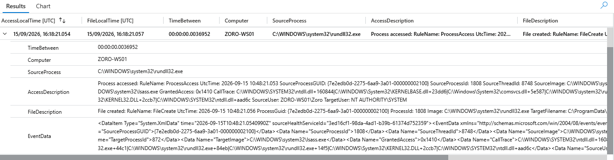

After reviewing the results, the analyst identified a highly correlated sequence on **ZORO-WS01**.

The relevant events occurred at:

```text
LSASS Access : 16:18:21.054099 IST
Dump Created : 16:18:21.0577942 IST
```

The difference between the two events was approximately:

```text
3.6952 ms
```

The Event ID 10 record showed:

```text
SourceProcess = C:\WINDOWS\system32\rundll32.exe
Target       = C:\WINDOWS\system32\lsass.exe
GrantedAccess = 0x1410
```

The call trace also referenced:

```text
comsvcs.dll
```

The corresponding Event ID 11 record showed creation of:

```text
C:\ProgramData\Updater\lsass.dmp
```

The same Sysmon ProcessGuid was present in the correlated events, providing strong evidence that the same process instance accessed LSASS and subsequently created the dump.

This became the primary pivot for the investigation.

---

# Q2. Artifact Pivot

After identifying the LSASS dump, the analyst pivoted on the discovered working directory:

```text
C:\ProgramData\Updater
```

The following query was used to identify all telemetry associated with this path.

```kql
Event
| where tostring(EventData) has @"C:\ProgramData\Updater"
| extend IST = datetime_utc_to_local(TimeGenerated,"Asia/Kolkata")
| project IST, Computer, Source, EventID, EventData, RenderedDescription
| order by IST asc
```

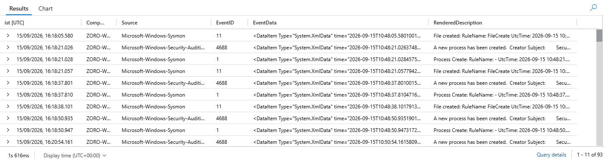

The results exposed a wider chain of activity involving the directory.

The first relevant activity was the creation of:

```text
C:\ProgramData\Updater
```

at approximately:

```text
16:18:05 IST
```

Subsequent events showed the creation and execution of the LSASS dump, KvcForensic-related files, downloaded components and later account and Registry activity.

The directory therefore provided a useful pivot for reconstructing the complete post-compromise sequence.

---

# Q3. Event Distribution

The analyst next examined which telemetry types were associated with the discovered artifact path.

```kql
Event
| where tostring(EventData) has @"C:\ProgramData\Updater"
| summarize EventCount = count() by EventID
| order by EventID asc
```

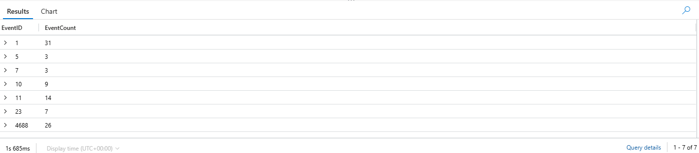

The query returned the following Event ID distribution:

| **Event ID** | **Count** |
| ------------ | --------- |
| 1            | 31        |
| 5            | 3         |
| 7            | 3         |
| 10           | 9         |
| 11           | 14        |
| 23           | 7         |
| 4688         | 26        |

The distribution showed that the artifact path was associated with multiple stages of process execution, file creation, process termination, image loading, LSASS access and file deletion.

This confirmed that the path was not associated with a single isolated event and justified deeper process-level investigation.

---

# Q4. Process Execution Timeline

The analyst then examined Sysmon Event ID 1 process-creation telemetry associated with the discovered directory.

```kql
Event
| where EventID == 1
| where tostring(EventData) has @"C:\ProgramData\Updater"
| extend IST = datetime_utc_to_local(TimeGenerated, "Asia/Kolkata")
| extend ImagePath = extract(@"<Data Name=""Image"">(.*?)</Data>", 1, tostring(EventData))
| extend CommandLine = extract(@"<Data Name=""CommandLine"">(.*?)</Data>", 1, tostring(EventData))
| extend User = extract(@"<Data Name=""User"">(.*?)</Data>", 1, tostring(EventData))
| extend ParentImagePath = extract(@"<Data Name=""ParentImage"">(.*?)</Data>", 1, tostring(EventData))
| extend ParentCommandLine = extract(@"<Data Name=""ParentCommandLine"">(.*?)</Data>", 1, tostring(EventData))
| extend Image = extract(@"([^\\]+)$", 1, ImagePath)
| extend ParentImage = extract(@"([^\\]+)$", 1, ParentImagePath)
| project IST, Computer, Image, CommandLine, User, ParentImage, ParentCommandLine
| order by IST asc
```

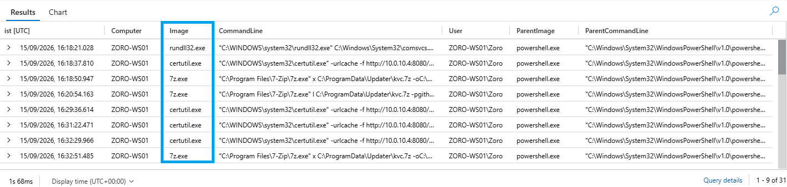

The results established the process sequence associated with the attack.

Important events included:

```text
16:18:21  rundll32.exe
16:18:37  certutil.exe
16:18:50  7z.exe extraction attempts
...
16:57:22  certutil.exe downloads kvc.exe
16:57:32  kvc.exe executes
17:01:28  kvc.exe executes
17:03:50  certutil.exe downloads KvcForensic.json
17:04:04  kvc.exe executes
17:04:22  notepad.exe opens output
17:05:00  net.exe creates BackupAdmin
17:05:04  net.exe adds BackupAdmin to Administrators
17:05:09  reg.exe modifies SpecialAccounts\UserList
```

The parent process information showed that the activity was executed from the elevated PowerShell session.

The repeated 7-Zip executions also showed that the attacker initially attempted to extract the KvcForensic archive before switching to direct retrieval of the executable.

---

# Q5. Network Telemetry Pivot

After reviewing the process execution timeline, the analyst identified:

```text
10.0.10.4:8080
```

as the destination used by `certutil.exe` to retrieve KvcForensic components.

The investigation therefore pivoted to Sysmon Event ID 3 network telemetry.

---

## Q5A. Network Connections to Attacker Host

```kql
Event
| where EventID == 3
| where tostring(EventData) has "10.0.10.4"
| extend IST = datetime_utc_to_local(TimeGenerated, "Asia/Kolkata")
| project IST, Computer, EventData, RenderedDescription
| order by IST asc
```

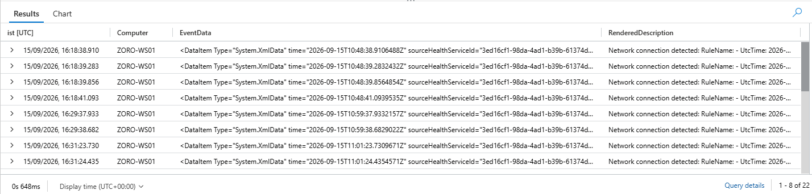

The query identified multiple connections involving:

```text
10.0.10.4
```

and, during the attack sequence, the relevant TCP destination:

```text
10.0.10.4:8080
```

The results also contained unrelated network activity, demonstrating that a simple IP-based search can produce additional noise.

More importantly, several relevant Event ID 3 records reported:

```text
<unknown process>
```

with an all-zero ProcessGuid.

Therefore, Event ID 3 alone could confirm that a network connection occurred, but could not independently attribute every relevant connection to `certutil.exe`.

Process attribution was therefore obtained from Event ID 1, while Event ID 3 was used as independent network corroboration.

---

## Q5B. Certutil Download and Network Correlation

After identifying the destination in the `certutil.exe` command lines, the analyst performed a second-stage temporal correlation between Event ID 1 and Event ID 3.

```kql
Event 
| where Source == "Microsoft-Windows-Sysmon" 
| where EventID in (1, 3) 
| extend EventDataText = tostring(EventData) 
| where EventDataText has_any ("certutil.exe", "10.0.10.4") 
| extend 
    EventType = case( 
        EventID == 1 and EventDataText has "certutil.exe", "CERTUTIL DOWNLOAD", 
        EventID == 3 and EventDataText has "10.0.10.4", "NETWORK CONNECTION", 
        "Other" 
    ) 
| where EventType != "Other" 
| extend 
    Image = extract(@"<Data Name=""Image"">(.*?)</Data>", 1, EventDataText), 
    CommandLine = extract(@"<Data Name=""CommandLine"">(.*?)</Data>", 1, EventDataText), 
    DestinationIP = extract(@"<Data Name=""DestinationIp"">(.*?)</Data>", 1, EventDataText), 
    DestinationPort = extract(@"<Data Name=""DestinationPort"">(.*?)</Data>", 1, EventDataText) 
| where EventType == "CERTUTIL DOWNLOAD" 
    or (DestinationIP == "10.0.10.4" and DestinationPort == "8080") 
| sort by Computer asc, TimeGenerated asc 
| serialize 
| extend 
    PreviousTime = prev(TimeGenerated), 
    PreviousEvent = prev(EventType), 
    PreviousCommandLine = prev(CommandLine), 
    PreviousImage = prev(Image), 
    PreviousDestinationIP = prev(DestinationIP), 
    PreviousDestinationPort = prev(DestinationPort), 
    PreviousComputer = prev(Computer) 
| where Computer == PreviousComputer 
| where EventType == "NETWORK CONNECTION" 
| where PreviousEvent == "CERTUTIL DOWNLOAD" 
| where TimeGenerated - PreviousTime <= 10s 
| extend 
    DownloadTimeIST = datetime_utc_to_local(PreviousTime, "Asia/Kolkata"), 
    NetworkTimeIST = datetime_utc_to_local(TimeGenerated, "Asia/Kolkata"), 
    TimeDifference = TimeGenerated - PreviousTime 
| project 
    DownloadTimeIST, 
    NetworkTimeIST, 
    TimeDifference, 
    Computer, 
    DownloadCommand = PreviousCommandLine, 
    DestinationIP = PreviousDestinationIP, 
    DestinationPort, 
    NetworkEvent = RenderedDescription 
| order by DownloadTimeIST asc
```

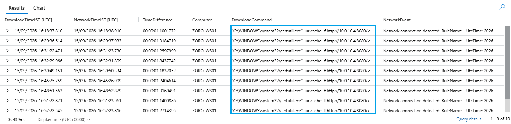

The second-stage correlation showed repeated temporal alignment between `certutil.exe` downloads and TCP connections to:

```text
10.0.10.4:8080
```

The correlated events generally occurred within approximately:

```text
1.1 – 1.8 seconds
```

This provided strong network corroboration for the tool-transfer activity.

The important distinction is that Event ID 1 provided the process attribution:

```text
certutil.exe
```

while Event ID 3 independently confirmed the corresponding network activity.

This prevented the investigation from relying on either telemetry source in isolation.

---

# Q6. Process Termination

The analyst then reviewed Sysmon Event ID 5 process termination events associated with the working directory.

```kql
Event
| where EventID == 5
| where tostring(EventData) has @"C:\ProgramData\Updater"
| extend IST = datetime_utc_to_local(TimeGenerated, "Asia/Kolkata")
| project IST, Computer, EventData, RenderedDescription
| order by IST asc
```

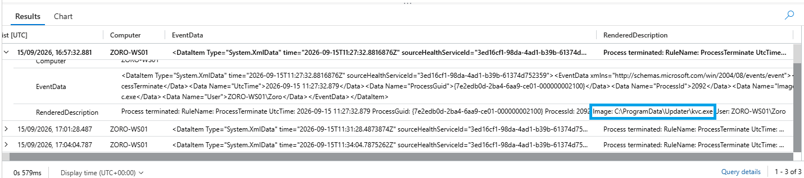

Three relevant process termination events were observed for `kvc.exe`:

```text
16:57:32
17:01:28
17:04:04
```

These events corroborated the repeated execution lifecycle observed in the process-creation telemetry.

The repeated executions were consistent with the troubleshooting process observed while getting KvcForensic to execute successfully.

---

# Q7. Image Load Corroboration

The analyst reviewed Sysmon Event ID 7 image-load telemetry associated with the artifact directory.

```kql
Event
| where EventID == 7
| where tostring(EventData) has @"C:\ProgramData\Updater"
| extend IST = datetime_utc_to_local(TimeGenerated, "Asia/Kolkata")
| project IST, Computer, EventData, RenderedDescription
| order by IST asc
```

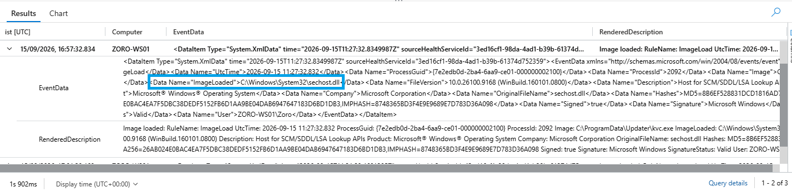

Three relevant image-load events were observed involving:

```text
kvc.exe
```

loading:

```text
C:\Windows\System32\sechost.dll
```

The loaded component was a valid Microsoft-signed Windows component.

The telemetry therefore supported the KvcForensic process lifecycle without providing evidence of a suspicious or unsigned DLL being loaded during the observed execution.

---

# Q8. File Creation Chain

The analyst next examined all Sysmon Event ID 11 file-creation activity associated with the working directory.

```kql
Event
| where EventID == 11
| where tostring(EventData) has @"C:\ProgramData\Updater"
| extend IST = datetime_utc_to_local(TimeGenerated, "Asia/Kolkata")
| project IST, Computer, EventData, RenderedDescription
| order by IST asc
```

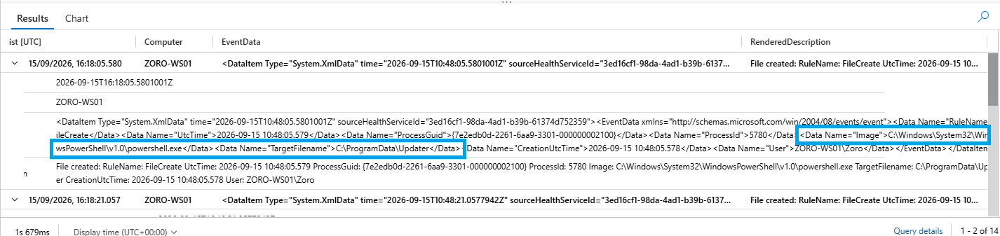

The results showed the progression of artifacts created during the investigation:

```text
C:\ProgramData\Updater
        ↓
lsass.dmp
        ↓
kvc.7z
        ↓
kvc.exe
        ↓
KvcForensic.json
        ↓
KvcForensic output files
```

The file-creation telemetry provided an independent view of the artifact chain and helped connect the process activity to the files actually created on the endpoint.

---

# Q9. File Deletion Analysis

The analyst then examined Sysmon Event ID 23 file-deletion telemetry associated with the same directory.

```kql
Event
| where EventID == 23
| where tostring(EventData) has @"C:\ProgramData\Updater"
| extend IST = datetime_utc_to_local(TimeGenerated, "Asia/Kolkata")
| project IST, Computer, EventData, RenderedDescription
| order by IST asc
```

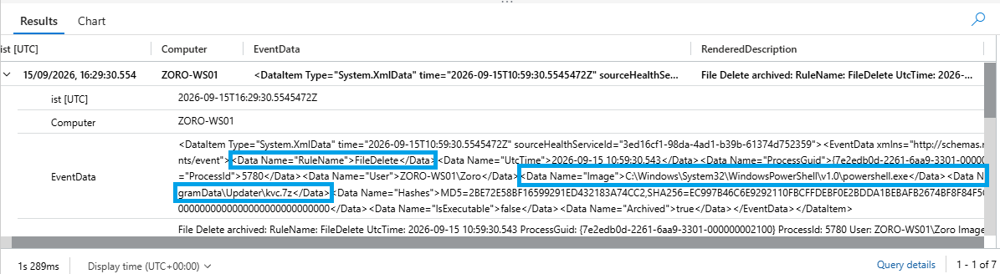

The results showed:

* Six deletions associated with PowerShell.
* One deletion associated with `certutil.exe`.
* Repeated creation, deletion and recreation of `kvc.7z`.

Different SHA256 values were observed for deleted file instances, indicating that the deleted archive instances were not necessarily identical.

The repeated replacement and deletion pattern indicated that the attacker struggled to get the KvcForensic tool working, consistent with the unsuccessful archive-extraction attempts before switching to direct retrieval of `kvc.exe`.

The observed deletions were therefore interpreted as tool-acquisition and troubleshooting behavior rather than being automatically classified as attacker cleanup activity.

---

# Q10. Registry Modification

The analyst then reviewed Sysmon Event ID 13 Registry modification telemetry to validate the Registry change associated with the newly created account.

```kql
Event
| where EventID == 13
| where tostring(EventData) has @"SpecialAccounts\UserList"
| extend IST = datetime_utc_to_local(TimeGenerated, "Asia/Kolkata")
| project IST, Computer, EventData, RenderedDescription
| order by IST asc
```

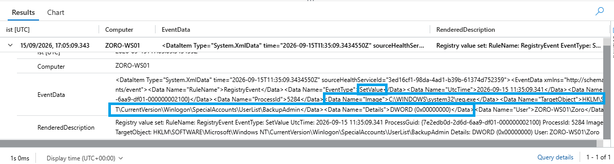

The event occurred at approximately:

```text
17:05:09 IST
```

The modified Registry value was:

```text
HKLM\SOFTWARE\Microsoft\Windows NT\CurrentVersion\Winlogon\SpecialAccounts\UserList\BackupAdmin
```

with:

```text
DWORD (0x00000000)
```

The change was performed by:

```text
reg.exe
```

The value of `0` was intended to hide `BackupAdmin` from the normal Windows interactive logon interface.

This provided direct telemetry confirming the Registry modification rather than relying only on the process command line.

---

# Q11. Local Account Creation

The final investigation query reviewed Windows Security Event ID 4720 for newly created local accounts.

```kql
Event
| where EventID == 4720
| extend IST = datetime_utc_to_local(TimeGenerated, "Asia/Kolkata")
| project IST, Computer, EventData, RenderedDescription
| order by IST asc
```

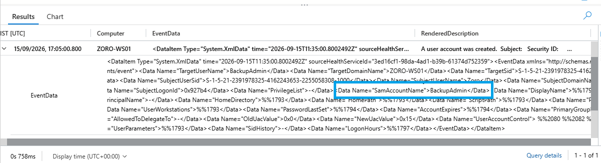

The event showed the creation of:

```text
BackupAdmin
```

on:

```text
ZORO-WS01
```

The account was created by the `Zoro` user.

The event also showed the new account SID ending in:

```text
1004
```

and the account UAC information.

The rendered event displayed:

```text
Password Last Set: <never>
Account Expires: <never>
```

The raw EventData contained the underlying Windows security fields, including:

```text
PasswordLastSet = %%1794
```

This value does not expose a plaintext password.

The separate Sysmon process-creation telemetry captured the controlled command used to create the account:

```text
net user BackupAdmin P@ssw0rd123! /add
```

Therefore, the password supplied during the controlled simulation was established from the process-creation evidence rather than inferred from Event ID 4720.

---

# Endpoint Validation

The analyst subsequently validated the observed artifacts directly on ZORO-WS01.

The working directory was checked using:

```powershell
Get-ChildItem "C:\ProgramData\Updater" -Force |
    Select-Object Mode, LastWriteTime, Length, Name
```

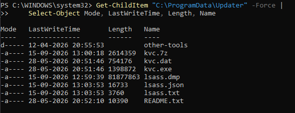

The endpoint contained the expected artifacts associated with the attack sequence.

The LSASS dump was approximately:

```text
80 MB
```

The directory contents correlated with the files identified through Sentinel and Sysmon telemetry.

The analyst also opened the KvcForensic output directly on the endpoint to validate the results produced from the captured LSASS memory.

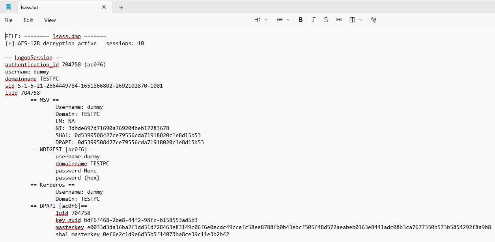

KvcForensic successfully analyzed the captured LSASS memory and produced credential-related material, including:

* NT hash material
* DPAPI-related material

This provided endpoint-level validation that the LSASS dump contained sensitive credential material and that the captured memory had been successfully processed.

Because LSASS memory was obtained, credentials associated with the affected endpoint should be considered potentially exposed during a real incident.

---

# Attack Reconstruction

After completing the investigation, the analyst correlated the collected telemetry with the controlled attack activity performed within the SOC laboratory.

The reconstructed attack chain was:

```text
Administrator leaves an elevated PowerShell session open
                    ↓
Attacker accesses the existing elevated session
                    ↓
Create C:\ProgramData\Updater
                    ↓
Discover LSASS PID
                    ↓
rundll32.exe
        ↓
comsvcs.dll MiniDump
        ↓
lsass.exe memory
        ↓
C:\ProgramData\Updater\lsass.dmp
                    ↓
certutil.exe downloads KvcForensic
                    ↓
KvcForensic analyzes LSASS dump
                    ↓
Credential-related material obtained
                    ↓
Create BackupAdmin
                    ↓
Add BackupAdmin to local Administrators
                    ↓
Set SpecialAccounts\UserList\BackupAdmin = 0
```

The initial foothold used to reach the endpoint was intentionally outside the scope of this investigation.

---

# Attack Timeline

The investigation established the following sequence around the post-compromise activity:

| **Time (IST)**  | **Activity**                                      |
| --------------- | ------------------------------------------------- |
| 16:18:05        | `C:\ProgramData\Updater` directory created        |
| 16:18:21.054    | `rundll32.exe` accesses `lsass.exe`               |
| 16:18:21.058    | `lsass.dmp` created                               |
| 16:18:37        | `certutil.exe` downloads `kvc.7z`                 |
| 16:18:50 onward | Multiple 7-Zip extraction attempts                |
| 16:57:22        | `certutil.exe` downloads `kvc.exe`                |
| 16:57:32        | KvcForensic analyzes the LSASS dump               |
| 17:03:50        | `certutil.exe` downloads `KvcForensic.json`       |
| 17:04:04        | KvcForensic analysis/output activity              |
| 17:04:22        | KvcForensic output opened in Notepad              |
| 17:05:00        | `BackupAdmin` account created                     |
| 17:05:04        | `BackupAdmin` added to local Administrators       |
| 17:05:09        | `SpecialAccounts\UserList\BackupAdmin` set to `0` |

The timeline demonstrates a progression from credential access to credential analysis and subsequent account manipulation.

---

# Scope Assessment

| **Question**                  | **Finding**                            |
| ----------------------------- | -------------------------------------- |
| Affected hosts                | 1 – ZORO-WS01                          |
| Credentials at risk           | Yes – LSASS dump obtained and analyzed |
| New local account             | Yes – `BackupAdmin`                    |
| Privileged account            | Yes – added to local Administrators    |
| Lateral movement              | Not observed                           |
| Exfiltration                  | Not observed                           |
| Remote credential use         | Not observed                           |
| Additional affected endpoints | None identified                        |

The investigation remained confined to the single Windows endpoint involved in the controlled scenario.

Lateral movement and credential exfiltration were not performed as part of Investigation 003.

---

# IOC Summary

## Network

```text
10.0.10.4:8080
```

## Files

```text
C:\ProgramData\Updater\lsass.dmp
C:\ProgramData\Updater\kvc.7z
C:\ProgramData\Updater\kvc.exe
C:\ProgramData\Updater\KvcForensic.json
C:\ProgramData\Updater\output_KvcForensic.txt
C:\ProgramData\Updater\output_KvcForensic.json
```

## Executables and Tools

```text
rundll32.exe
certutil.exe
7z.exe
kvc.exe
net.exe
reg.exe
```

## Account

```text
BackupAdmin
```

## Registry

```text
HKLM\SOFTWARE\Microsoft\Windows NT\CurrentVersion\Winlogon\SpecialAccounts\UserList\BackupAdmin
```

## Compressed Archive

```text
kvc.7z
```

The archive was a 7-Zip compressed archive used to transfer the KvcForensic tool into the endpoint during the controlled simulation.

---

# Containment Actions

Following confirmation of the credential-access and account-manipulation activity, production-style containment actions were considered.

## Endpoint Isolation

In a production environment, **EDR or NAC isolation of ZORO-WS01** would be the preferred containment action.

The objective would be to prevent the affected endpoint from communicating with other systems while preserving the machine for investigation.

No laboratory firewall rule was used as the containment mechanism.

---

## Preserve Evidence

The following evidence should be preserved before artifact removal:

```text
LSASS dump
KvcForensic outputs
Sentinel telemetry
Sysmon event records
Windows Security event records
Relevant process command lines
```

The LSASS dump contains sensitive credential material and should be treated as protected forensic evidence.

Because LSASS memory was obtained and analyzed, credentials associated with the affected endpoint should be considered potentially exposed and reset as appropriate during a real incident.

---

## Remove Created Account, Registry Value and Artifacts

The controlled laboratory artifacts were removed using the following commands.

### Remove BackupAdmin

```powershell
net user BackupAdmin /delete
```

### Remove Registry Value

```powershell
reg delete "HKLM\SOFTWARE\Microsoft\Windows NT\CurrentVersion\Winlogon\SpecialAccounts\UserList" /v BackupAdmin /f
```

### Remove Investigation Artifacts

```powershell
Remove-Item "C:\ProgramData\Updater" -Recurse -Force
```

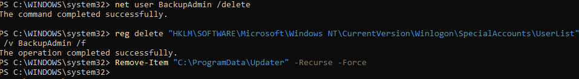

The endpoint should subsequently be checked to confirm that the account, Registry value and temporary investigation artifacts have been removed.

---

# Detection Engineering

After completing the investigation and containment, the observed LSASS credential-access behavior was converted into a **Microsoft Sentinel Scheduled Analytics Rule**.

Rather than detecting only the specific indicators from this incident, such as:

```text
rundll32.exe
comsvcs.dll
C:\ProgramData\Updater
lsass.dmp
10.0.10.4
```

the detection was designed around the behavioral relationship:

```text
Process accesses LSASS
        ↓
Same process creates a .dmp file
```

This allows the detection to remain useful even if an attacker changes the executable, path, filename or infrastructure.

---

## Detection Query

The final behavioral detection query was:

```kql
let LSASSAccess = Event
| where Source == "Microsoft-Windows-Sysmon"
| where EventID == 10
| extend TargetImage = extract(@"TargetImage:\s*([^\s]+)", 1, RenderedDescription)
| where TargetImage endswith @"\lsass.exe"
| extend SourceProcessGUID = extract(@"SourceProcessGUID:\s*\{([^}]+)\}", 1, RenderedDescription)
| extend SourceImage = extract(@"SourceImage:\s*([^\s]+)", 1, RenderedDescription)
| extend SourceImageName = extract(@"([^\\]+)$", 1, SourceImage)
| extend GrantedAccess = extract(@"GrantedAccess:\s*([^\s]+)", 1, RenderedDescription)
| extend CallTrace = extract(@"CallTrace:\s*(.+?)\s*SourceUser", 1, RenderedDescription)
| project
    AccessTime = TimeGenerated,
    Computer,
    SourceProcessGUID,
    SourceImage,
    SourceImageName,
    GrantedAccess,
    CallTrace;
let DumpCreation = Event
| where Source == "Microsoft-Windows-Sysmon"
| where EventID == 11
| where RenderedDescription has ".dmp"
| extend ProcGUID = extract(@"ProcessGuid:\s*\{([^}]+)\}", 1, RenderedDescription)
| extend Image = extract(@"Image:\s*([^\s]+)", 1, RenderedDescription)
| extend TargetFilename = extract(@"TargetFilename:\s*([^\s]+)", 1, RenderedDescription)
| project
    FileTime = TimeGenerated,
    Computer,
    ProcGUID,
    Image,
    TargetFilename;
let DefenderDetections = Event
| where Source has "Microsoft-Windows-Windows Defender"
| where EventID == 1116
| where TimeGenerated > ago(24h)
| extend ThreatName = extract(@"Name:\s*([^\r\n]+)", 1, RenderedDescription)
| extend DefenderPath = extract(@"Path:\s*(.+?)(?:\r?\n|Detection Origin|Process Name:)", 1, RenderedDescription)
| extend DefenderProcessName = extract(@"Process Name:\s*([^\r\n]+)", 1, RenderedDescription)
| extend DetectionID = extract(@"Detection ID:\s*(\{[^}]+\})", 1, RenderedDescription)
| project
    DefenderTime = TimeGenerated,
    Computer,
    DetectionID,
    ThreatName,
    DefenderPath,
    DefenderProcessName;
let DefenderActions = Event
| where Source has "Microsoft-Windows-Windows Defender"
| where EventID == 1117
| where TimeGenerated > ago(24h)
| extend DetectionID = extract(@"Detection ID:\s*(\{[^}]+\})", 1, RenderedDescription)
| extend ActionName = extract(@"Action:\s*([^\r\n]+)", 1, RenderedDescription)
| project
    ActionTime = TimeGenerated,
    Computer,
    DetectionID,
    ActionName;
let BehaviorCorrelation = LSASSAccess
| join kind=inner DumpCreation
    on Computer, $left.SourceProcessGUID == $right.ProcGUID
| where FileTime between (AccessTime .. AccessTime + 2m)
| extend TimeBetween = FileTime - AccessTime;
BehaviorCorrelation
| join kind=leftouter (
    DefenderDetections
) on Computer
| where
    isnull(DefenderTime)
    or (
        DefenderTime between (AccessTime .. FileTime + 2m)
        and (
            DefenderPath has SourceImage
            or DefenderPath has TargetFilename
            or DefenderProcessName has SourceImageName
        )
    )
| join kind=leftouter (
    DefenderActions
) on DetectionID
| summarize
    AccessIST = any(datetime_utc_to_local(AccessTime, "Asia/Kolkata")),
    FileIST = any(datetime_utc_to_local(FileTime, "Asia/Kolkata")),
    TimeBetween = any(TimeBetween),
    SourceImage = any(SourceImage),
    GrantedAccess = any(GrantedAccess),
    CallTrace = any(CallTrace),
    TargetFilename = any(TargetFilename),
    DefenderDetectionIDs = make_set_if(DetectionID, isnotempty(DetectionID)),
    DefenderThreats = make_set_if(ThreatName, isnotempty(ThreatName)),
    DefenderPaths = make_set_if(DefenderPath, isnotempty(DefenderPath)),
    DefenderProcessNames = make_set_if(DefenderProcessName, isnotempty(DefenderProcessName)),
    DefenderActions = make_set_if(ActionName, isnotempty(ActionName))
    by Computer, SourceProcessGUID
| extend Confidence = case(
    array_length(DefenderDetectionIDs) > 0,
        "High - Behavioral Chain + Relevant Defender Detection (1116)",
    "Medium - Behavioral Chain Confirmed"
)
| project
    AccessIST,
    FileIST,
    TimeBetween,
    Computer,
    SourceImage,
    GrantedAccess,
    TargetFilename,
    Confidence,
    DefenderThreats,
    DefenderPaths,
    DefenderProcessNames,
    DefenderActions,
    DefenderDetectionIDs,
    CallTrace
| order by AccessIST desc
```

The two-minute correlation window was intentionally tuned for this laboratory investigation. The actual observed LSASS-access-to-dump interval was only **3.6952 ms**.

The detection does not hardcode:

```text
rundll32.exe
comsvcs.dll
MiniDump
lsass.dmp
C:\ProgramData\Updater
kvc.exe
10.0.10.4
```

This makes the logic behavioral rather than dependent on the exact indicators used during the simulation.

---

## Detection Result

The detection identified the LSASS access and subsequent `.dmp` creation on ZORO-WS01 within the configured two-minute correlation window.

The observed interval was only:

```text
3.6952 ms
```

and the same Sysmon ProcessGuid correlated the two events.

Because Defender Operational telemetry was not ingested into the laboratory Sentinel workspace, the result was classified as:

```text
Medium - Behavioral Chain Confirmed
```

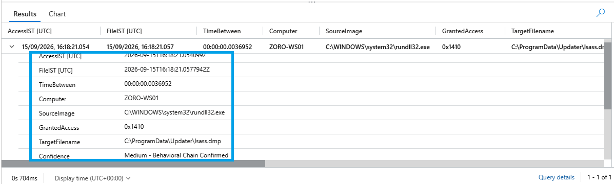

---

## Detection Logic

The detection uses two primary telemetry sources.

### Event ID 10 – Process Access

Event ID 10 identifies a process opening another process.

The query specifically identifies access to:

```text
lsass.exe
```

This establishes the first behavioral stage.

### Event ID 11 – File Creation

Event ID 11 identifies file creation activity.

The query searches for:

```text
.dmp
```

files created after the LSASS access.

### ProcessGuid Correlation

The detection correlates the events using:

```text
Computer
+
ProcessGuid
```

`ProcessGuid` is a Sysmon-generated identifier for a process instance.

This allows the analyst to establish that the same process instance accessed LSASS and subsequently created the dump rather than relying only on a process ID or executable name.

### Temporal Correlation

The dump creation must occur after the LSASS access and within:

```text
2 minutes
```

This prevents unrelated LSASS access and unrelated dump-file creation from automatically being treated as one malicious sequence.

### Defender Enrichment

Microsoft Defender Event ID 1116 can provide additional confidence when a relevant Defender detection occurs in the same host and time context.

Event ID 1117 provides additional action context.

These events are treated as enrichment rather than mandatory detection requirements because Defender Operational telemetry was not ingested into the current laboratory Sentinel workspace.

---

## Confidence Classification

| **Confidence**                                                   | **Meaning**                                                                                            |
| ---------------------------------------------------------------- | ------------------------------------------------------------------------------------------------------ |
| **High - Behavioral Chain + Relevant Defender Detection (1116)** | LSASS access followed by same-process dump creation with a relevant Defender Event ID 1116             |
| **Medium - Behavioral Chain Confirmed**                          | LSASS access followed by same-process dump creation without relevant Defender Event ID 1116 enrichment |

The current laboratory result was:

```text
Medium - Behavioral Chain Confirmed
```

---

## Behavioral Detection Approach

The detection deliberately does not search for a specific:

```text
Tool
Filename
Directory
IP address
Command line
```

Instead, it searches for the relationship between:

```text
LSASS Access
     ↓
Same Process
     ↓
Dump Creation
```

This provides broader coverage against variations of the same credential-access behavior.

The detection still has limitations.

A dump may be created without using a `.dmp` extension, and LSASS access can also be performed legitimately by security products, diagnostics and administrative tools.

Therefore, production deployment would require appropriate baseline tuning and allowlisting of known-good software.

---

# Scheduled Analytics Rule Deployment

The detection logic was converted into a Microsoft Sentinel **Scheduled Analytics Rule** named:

```text
Suspicious LSASS Access Followed by Dump Creation
```

The rule was configured as a **High severity** custom analytics rule and enabled in the Sentinel workspace.

The analytics rule uses the behavioral detection query to identify LSASS access followed by same-process dump creation.

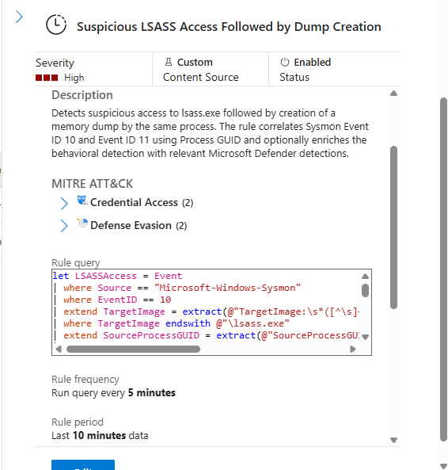

---

# MITRE ATT&CK Mapping

| **Technique ID** | **Technique**                                           | **Evidence**                                                          |
| ---------------- | ------------------------------------------------------- | --------------------------------------------------------------------- |
| **T1003.001**    | OS Credential Dumping: LSASS Memory                     | `rundll32.exe` used with `comsvcs.dll MiniDump` against `lsass.exe`   |
| **T1218.011**    | System Binary Proxy Execution: Rundll32                 | `rundll32.exe` executed `comsvcs.dll`                                 |
| **T1105**        | Ingress Tool Transfer                                   | `certutil.exe` retrieved KvcForensic components                       |
| **T1136.001**    | Create Account: Local Account                           | `BackupAdmin` created using `net user`                                |
| **T1098.007**    | Account Manipulation: Additional Local or Domain Groups | `BackupAdmin` added to the local Administrators group                 |
| **T1112**        | Modify Registry                                         | `SpecialAccounts\UserList\BackupAdmin` was modified                   |
| **T1059.001**    | Command and Scripting Interpreter: PowerShell           | Elevated PowerShell was the execution context for the attack activity |

The investigation does not map the observed file deletions to a cleanup technique because the deletion activity was associated with repeated KvcForensic archive replacement and troubleshooting rather than confirmed attacker cleanup.

The investigation also does not map analyst-generated discovery commands as attacker techniques.

---

# Findings

The investigation confirmed that:

* An attacker leveraged an **existing elevated PowerShell session** that had been left open after administrator troubleshooting.
* **Sysmon Event ID 10** detected access to LSASS by `rundll32.exe`.
* **Sysmon Event ID 11** showed the same process created `C:\ProgramData\Updater\lsass.dmp`.
* The same **ProcessGuid** correlated the LSASS access and dump creation.
* The LSASS dump was approximately **80 MB**.
* KvcForensic successfully analyzed the dump and produced credential-related material, including an **NT hash and DPAPI-related material**.
* `certutil.exe` was used to retrieve KvcForensic components from **10.0.10.4:8080**.
* Repeated archive create/delete activity showed that the attacker struggled to get the tool working before switching to direct `kvc.exe` retrieval.
* `BackupAdmin` was created and added to the local **Administrators** group.
* `SpecialAccounts\UserList\BackupAdmin` was set to `0`, intended to hide the account from the normal interactive logon interface.
* Event ID 3 corroborated network activity but did not independently attribute every relevant connection to `certutil.exe`; Event ID 1 provided the process attribution.
* Raw Windows Security EventData provided underlying account-creation fields that were useful for analyst validation.
* No lateral movement, remote credential use or exfiltration was observed or performed.
* A behavioral Microsoft Sentinel detection was developed for LSASS access followed by same-process dump creation.
* No separate `certutil.exe` misuse detection was developed because the primary focus of Investigation 003 was credential dumping.

---

# Detection Gap & Recommendations

The investigation identified several areas where detection coverage can be improved.

## 1. Dump Without a `.dmp` Extension

The current detection uses the `.dmp` condition in Event ID 11.

An attacker could create a memory dump using another extension or naming convention.

Future detection should therefore investigate suspicious LSASS access independently of the resulting filename extension.

---

## 2. LSASS Access Without a Dump File

Credential material may potentially be accessed without writing a dump file to disk.

The current:

```text
Event ID 10
      ↓
Event ID 11
```

correlation would not detect every possible LSASS credential-access technique.

A separate behavioral detection focused on suspicious LSASS access should therefore be considered.

---

## 3. Legitimate LSASS Access

Security software, diagnostics and administrative tools can legitimately access LSASS.

Event ID 10 alone should therefore not automatically be treated as malicious.

Production detection should incorporate:

* Known-good software baselines
* Trusted process allowlists
* Negative testing
* Process context
* User context

---

## 4. Defender Telemetry Not Ingested

Defender Event IDs 1116 and 1117 were not available in the Sentinel workspace during the investigation.

The behavioral detection was therefore validated primarily using Sysmon and Windows Security telemetry.

Future improvements should include Defender Operational telemetry to provide additional detection and response context.

---

## 5. IOC and Threat Intelligence Enrichment

No external malware-analysis or threat-intelligence enrichment was performed during this investigation.

The following indicators should therefore be treated as laboratory-scoped indicators:

```text
10.0.10.4
C:\ProgramData\Updater
kvc.exe
kvc.7z
```

No external reputation, hash or infrastructure validation is implied by this investigation.

---

## 6. LOLBin Detection Coverage

The investigation demonstrated the use of several native Windows tools:

```text
rundll32.exe
certutil.exe
net.exe
reg.exe
```

Separate detections for:

* Suspicious `certutil.exe` transfers
* Local account creation
* Privileged-group modification
* Sensitive Registry modification

were not developed as independent detection rules in this investigation.

Specifically, **no separate `certutil.exe` misuse detection rule was created because the primary focus of Investigation 003 was credential dumping**.

These behaviors provide natural candidates for future investigations and detection-engineering exercises.

---

# Reality Check

The investigation was performed under deliberately relaxed laboratory conditions.

Defender Real-time Protection, Tamper Protection and LSA Protection/PPL were disabled so that the credential-access behavior could execute for telemetry and detection-engineering purposes.

The attack was initially tested with the normal security controls enabled. Microsoft Defender blocked the activity, including the `rundll32.exe`/MiniDump behavior.

Even after Real-time Protection was disabled and exclusions were tested, attempts involving `certutil.exe` and the LSASS dump continued to trigger Defender detections.

Further research identified LSA Protection/PPL as an additional control preventing LSASS memory access.

After LSA Protection/PPL was disabled, the controlled credential-dumping sequence completed successfully.

This behavior is important when interpreting the laboratory results. A production Windows endpoint with modern Defender protections and LSA Protection enabled may block the same attack before the complete chain executes.

This is also why Defender Event ID 1116 was included in the detection design as confidence enrichment. The laboratory demonstrated that endpoint protection can independently detect and block credential-dumping behavior, while Sentinel provides behavioral telemetry for investigation and detection engineering.

---

# Key Investigation Takeaways

* **Behavioral hunting can reveal credential dumping** without prior knowledge of the exact attacker filename, tool or directory.
* **ProcessGuid matters** because it allows the analyst to establish that the same process instance accessed LSASS and created the dump.
* **Raw EventData matters** because underlying fields can preserve useful values and structure that rendered descriptions may simplify.
* **Endpoint validation increases confidence** by confirming Sentinel observations against the actual Windows endpoint.
* **LSASS dump exposure should trigger credential-reset consideration** during a real incident.
* **LOLBins can form an attack chain**, including `rundll32.exe`, `certutil.exe`, `net.exe` and `reg.exe`.
* **Detection should prioritize behavior over fixed IOCs** wherever practical.
* **Network telemetry should be interpreted carefully.** Event ID 3 can corroborate a connection while still lacking reliable process attribution.
* **Defender prevention and Sentinel detection serve complementary purposes.** Endpoint protection may block the behavior, while SIEM telemetry provides investigation and correlation visibility.
* **Evidence must be distinguished from assumptions.** The investigation did not treat attempted network activity, file deletion or raw account fields as stronger evidence than the telemetry actually supported.

---

# Conclusion

Investigation 003 reconstructed a post-compromise credential-access sequence beginning with abuse of an already-elevated PowerShell session.

The attacker created a working directory, identified LSASS, dumped its memory through `rundll32.exe` and `comsvcs.dll`, retrieved and executed KvcForensic, and subsequently created and privileged a local account.

Sentinel hunting established the sequence through Sysmon process-access, file-creation, process, network and Registry telemetry together with Windows Security account-management telemetry.

The same ProcessGuid correlated the LSASS access and dump creation, enabling a behavioral detection that does not depend on the exact LOLBin, filename, path or attacker IP.

The investigation also demonstrated the difference between endpoint prevention and SIEM detection. Defender blocked the behavior under hardened conditions, while the controlled laboratory configuration allowed the complete chain to execute for telemetry analysis and detection engineering.

The final detection therefore moves beyond the specific indicators used in the laboratory scenario and provides a foundation for identifying similar LSASS credential-access activity in future investigations.

```

